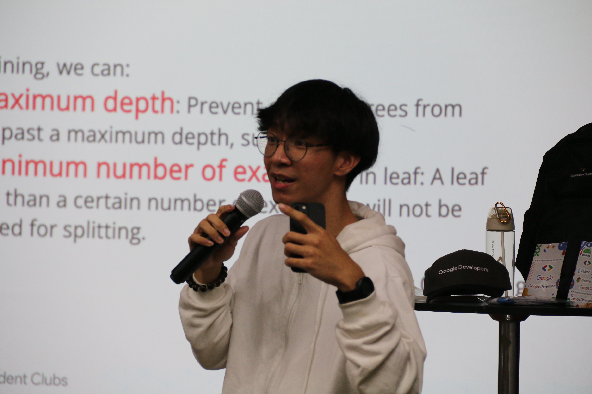

# Introduction

Hi! I'm Jun Xian, a student in the Software Maintenance and Evolution course. I'm expecting an overview of how i can better build my future projects and further maintain them in good shape with all the modern software maintenance practices and how to work with legacy systems.

- **Fun fact**: I play guitar, run marathons, meditate and sing a lot.
- **Course expectations**: To gain hands-on experience in maintaining and evolving software.

## GitHub Profile

Link to customized Github profile:
[here] (https://github.com/JunnXiann?tab=overview&from=2024-10-01&to=2024-10-14)